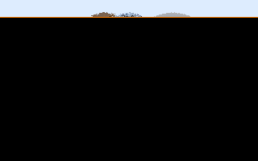

# x86-bare-metal-raytracer

[](https://github.com/mosmeh/x86-bare-metal-raytracer/actions)

An implementation of [Ray Tracing in One Weekend](https://raytracing.github.io/books/RayTracingInOneWeekend.html) in x86 bare-metal environments.



## How to run

First, install dependencies:

```sh
# on Ubuntu
sudo apt install gcc-multilib grub2 mtools xorriso qemu-system-x86
```

Then run the following command to build and run:

```
make run
```

It also creates a disk image file called `disk_image`. You can simply copy it onto a disk and boot it.

## Controls

-   <kbd>R</kbd>: Generate a random scene and start over
-   <kbd>S</kbd>: Turn on/off drawing a scanline
